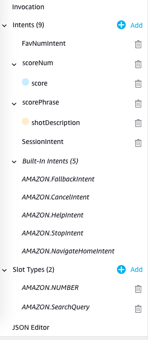

# Amazon Alexa Skill Development Template

## Step by Step Guide - Code
### Before we get started do the following taks

 - Create AWS Account 
 - Create Alexa Developer account 
 - Create a skill
 - make End-points  and link with AWS Lambda

### Coding part
 1. Alexa Says [Hello World](https://github.com/itzpc/Alexa_FavNumApp/blob/6a57fa541ff7f2dbf4149ba13957f90a694e84bd/lambda_function.py) - The Beginning
 2. Alexa Calls an [Intent](https://github.com/itzpc/Alexa_FavNumApp/blob/472b440ea45235ebfea91ebd8deb7637eb70bdf4/lambda_function.py) 
			 - Create an intent named `FavNumIntent` 
			 - Create the uttarance for the intent
 3. Alexa calls an [Intent with Slots](https://github.com/itzpc/Alexa_FavNumApp/blob/f809ed7513996de621323469ecec0724e62efe76/lambda_function.py)
			- Create slot    `scoreNum` Intent having Digit slot (AMAZON.Digit) `score` and `scorePhrase` Intent having Phrase Slot (AMAZON.SearchQuery) `shotDescription`
			 - modify intent for created slots
 4.  Alexa create [Session](https://github.com/itzpc/Alexa_FavNumApp/blob/e700ee361854f0c723edd9f6d076049c6d89f709/lambda_function.py) for prolonged conversation 
	 - making the uttarance session will increment the `counter` in the session.

### Images of Intents and slots

#### Possible uttarances used

**invocation**

> cricket

**uttarances**

Calling a sample intent
> What  is  your  fav  number

Digit Phrase

> cricket  score  {score}

> cricket  {score}  scored

Short Phrase
> {shotDescription}  Shot

Session
> start  counting
> count
